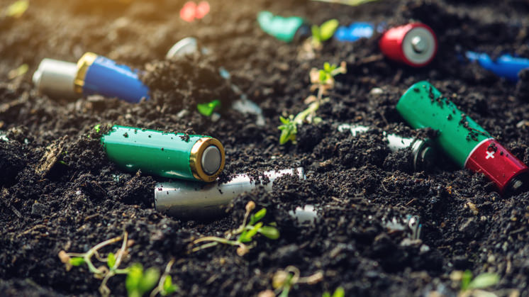

# 🌍 Proyecto 1: Protección Medioambiental

---

## 📝 Criterios de Calificación

| Nº | Criterio | Puntuación |
|----|----------|------------|
| 1 | Estructura completa: **Título, Índice, Referencias y Autores** | 1 punto |
| 2 | Mínimo **4 imágenes** | 1 punto |
| 3 | Desarrollo correcto de los contenidos | 1 punto por apartado |
| 4 | Uso de características de **Markdown no vistas en clase** | 1 punto |
| 5 | Trabajo colaborativo en grupos diferentes | Obligatorio |

---

## 📚 Índice

1. [¿Qué es la contaminación ambiental?](#que-es-la-contaminacion-ambiental)
2. [Residuos informáticos](#residuos-informaticos)
3. [Obsolescencia programada](#obsolescencia-programada)
4. [Informática ecológica](#informatica-ecologica)
5. [Referencias](#referencias)
6. [Autores](#autores)

---

## Que es la contaminacion ambiental

La contaminación ambiental es el deterioro del medio ambiente causado por la introducción de sustancias o materiales que son dañinos para el aire, el agua o el suelo.

  

La contaminación afecta a animales, plantas e incluso a las personas, provocando problemas de salud con el tiempo y contribuyendo al cambio climático.  
Es importante aplicar medidas como reciclar y usar los recursos de forma responsable y renovable.

---

## Residuos informaticos

(Contenido aquí)

---

## Obsolescencia programada

(Contenido aquí)

---

## Informatica ecologica

(Contenido aquí)

---

## Referencias

(Añadir enlaces aquí)

---

## Autores

(Añadir nombres aquí)

---
